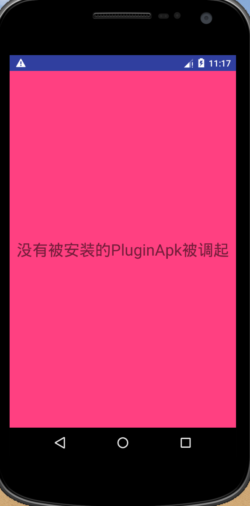

# 插件化探索demo

测试步骤：
1. 将pluginapp工程打包得到pluginapp-debug.apk文件；
2. 将pluginapp-debug.apk文件拷贝至app工程的assets目录；
3. 运行app程序；
4. 主界面点击"加载插件Apk"按钮(该过程会先模拟从服务器下载插件apk文件，然后加载插件apk)；
5. 点击"跳转到插件apk目标界面"按钮。

效果预览图：

